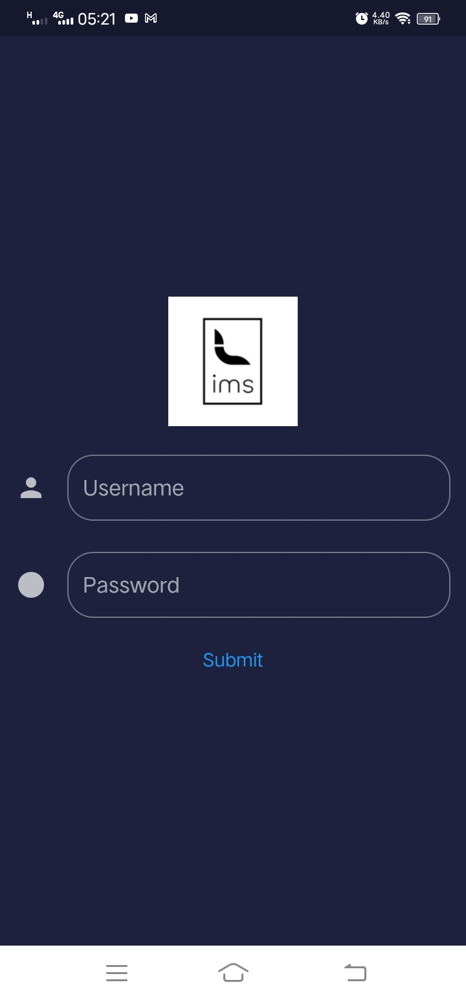

# Inventory Management Sales Dashboard

IMS Terminal is the client-side application for interacting with [IMS Backend](https://github.com/AyushPaudel/Inventory-Management-System). It aims to provide an interactive and user-friendly interface for the client to manage the inventory that includes the following features.

### For Admin User:
- Manage Products ( Create / Read / Update / Delete / Generate QR )
- Manage Staff ( Create / Read / Update / Delete / Send Credentials / Pay Salary )
- Manage Categories and Sub Categories ( Create / Read / Update / Delete )
- Analysis
- Billing ( Create Bill / Email Receipt / Print Receipt )

### For Staff User:
- Billing ( Create Bill / Email Receipt / Print Receipt )


## Technology Used
- [Flutter UI Toolkit](https://flutter.dev/)

## Steps to Run

1. Clone this repository ```git clone https://github.com/aadarshadhakalg/ims-mobile.git```
2. Go to the source folder ```cd ims-mobile```
3. Get packages ```flutter pub get```
4. Build and Run ```flutter run```


## Screenshots

### Desktop


### Mobile


|   |   |   |   |
| - | - | - | - |
|  |  |  |  |
|  |  |  |  |


## Inventory Management System ( IMS ) Ecosystem

- [IMS Terminal](https://github.com/aadarshadhakalg/ims-mobile/)
- [IMS Backend](https://github.com/AyushPaudel/Inventory-Management-System)
- [IMS Portal / IMS Coin](https://github.com/voidash/IMSCoin)
- [IMS Recommendation Engine](https://github.com/AnuragTimilsina/ImsRecommendationEngine)


## Our Team

  - [Aadarsha Dhakal](github.com/aadarshadhakalg/)
  - [Sujit KC](https://github.com/sujit08)
  - [Ashish Thapa](https://github.com/voidash/)
  - [Ayush Paudel](https://github.com/AyushPaudel/)
  - [Anurag Timilsina](https://github.com/anuragTimilsina/)


## License

The source code for the site is licensed under the MIT license, which you can find in the MIT-LICENSE.txt file.
All graphical assets are licensed under the [Creative Commons Attribution 3.0 Unported License](https://creativecommons.org/licenses/by/3.0/).
